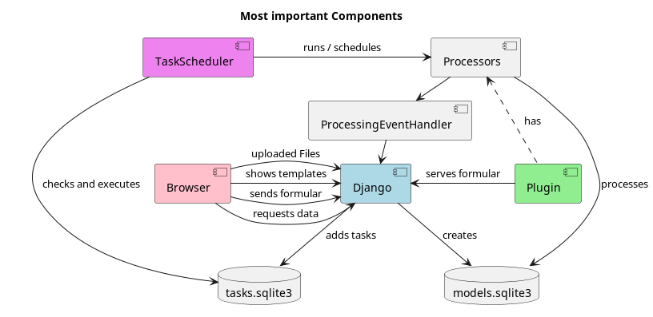

# Django App

## System Overview




See more diagrams [here](diagrams)

## Django

Python Web-Backend. It was chosen because the first plugin was already written in Python(Pdf Compressor).
Django is a simple python webserver with good documentation easy configuration good security and easy DB
integration. Other possibilities would have been Flask or Pyramid etc. but the simple and powerful Django-Admin was
the reason we decided to use Django.

Website Paths/ urls:

* `django_app/webserver` holds the views for user interaction
* `django_app/api` holds the views that deliver data to js or handle form-requests
* `django_app/media` holds all the uploaded and processed files

## Browser

The Browser has different views to interact with Django.
1. `/api/`
    * is used for functional requests such as file upload, getting data or actions of buttons, not for user interaction
2. is used for user interaction and is the main views  
   * `/download/` shows a view of past requests and lets users download processed files
   * `/main-view`|`/` shows a view to upload files and start processing through different plugins
     * uses Dropzone.js to upload files
     * gets different forms from `/api` which are further defined in the PluginForms class of each Plugin
     * these forms are then used to start the processing of the files with plugin specific settings

## Database

For the Database we chose sqlite3 because it is easy to set up and use. It is also the default database for Django.
It doesn't have great performance, but it is good simple multiplatform and does not require any setup.
There are two databases in use:

1. `django_app/models.sqlite3` holds the file and request data
2. `django_app/plugin_system/tasks.sqlite3` stores pickled tasks that are to be executed by the TaskScheduler (also contains the processing
   tasks)

## Processing

The taskScheduler class checks for changes in the tasks.db and if changes are detected
it starts processing (e.g. Compressing) by executing the Task object inside `django_app/task_scheduler/tasks.sqlite3`

## New Tasks

A Task can be added by constructing a subclass of `django_app.task_scheduler.tasks.task.Task` and call the create()
method.
After that the `Task.run()` method is executed automatically.

```python
from django_app.task_scheduler.tasks.task import Task


class MyCustomTask(Task):
    def run(self):
        pass  # do stuff


# add the task
MyCustomTask().create()
```

### ProcessingTask (extends Task)

used for File Processing (mainly of the plugins).

delivers default values that you can use, when its used as plugin Task

* `_source_path` folder inside `django_app/media` where the uploaded files of your request are
* `_destination_path` folder inside `django_app/media` where the result files should end up
* `_request_parameters` includes all form parameters of your custom form.

These values can be used to run `YourProcessor.process()` for your Plugin.

## Event Handler Class

every task should trigger certain events, that can be used by the program to determine progress or to apply different
processing like zipping or console logging

```python
class EventHandler(...):
    # is called before your processing task starts
    def started_processing(self): pass

    # is called after all processing has been finished and the result files exist in the destination directory
    def finished_all_files(self): pass

    # call before each processing of a file
    def preprocess(self, source_file: str, destination_file: str) -> None: pass

    # call after each processing of a file has been finished with source_file as the unchanged starting file
    # and destination_file the processed file
    def postprocess(self, source_file: str, destination_file: str) -> None: pass
```

### ProcessingEventHandler (extends EventHandler)

is used inside every ProcessingTask to assure the Processing Pipeline works.  
you can get an instance with `event_handler = super()._get_event_handler()` inside ProcessingTask  
After `finished_all_files()` is called the finished files are shown to the user on the download view.

## UML diagrams

diagrams are using the PlantUML integration plugin / syntax  
syntax can be found here: [https://plantuml.com](https://plantuml.com)

# TODOs

* **add remove all files button (per User) to download page**
* Selenium Tests
* POST value validating with django forms (inside webserver/views.py)**
* /media folder memory management (capacity per user etc.)
* GarbageCollector (regular cleanup of old Tasks, /media folder, /temporary_files folder)
    * deletes request, if it has no files
* option reserve/strip meta data
* option bookmarks
* download view delete button per request (deletes corresponding request, tasks and files)
* unittest with file_ending not all small chars
* unittest with more than 1, 10, 100 sites
* display errors in processing in the download view or somewhere else

* check options via imagemagick tool
* Online Admin view for Files, Requests etc, maybe some config stuff (like time how long files are saved etc)

https://mimetype.io/all-types/

# Plugin Ideas

* make compression plugin for pdf with password using cpdf
* combinations of PSD files
* OpenCV implementations
