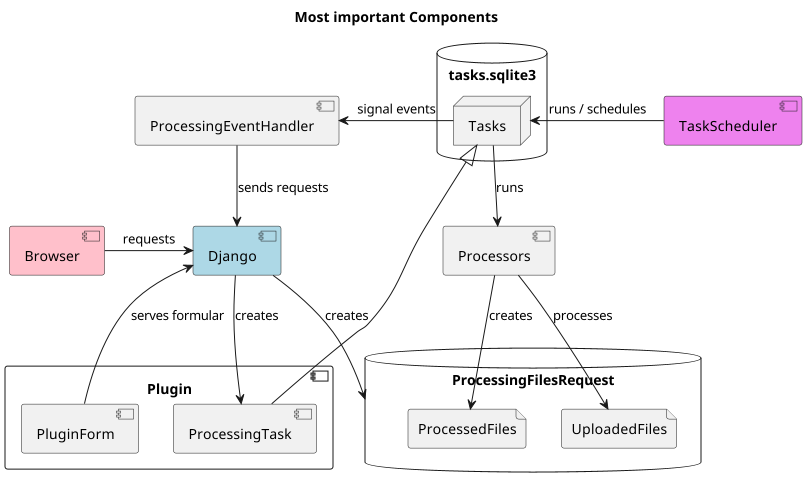
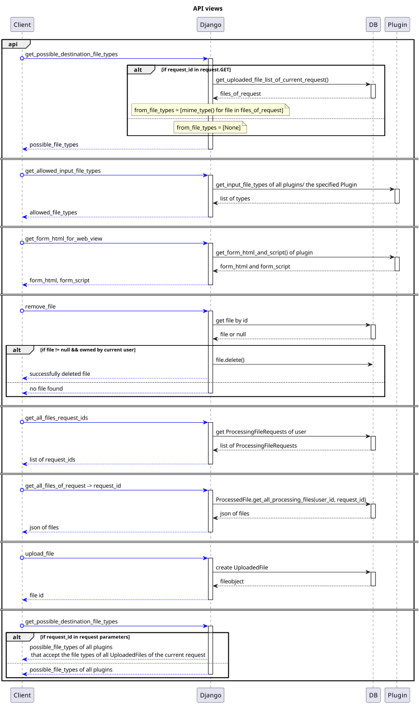
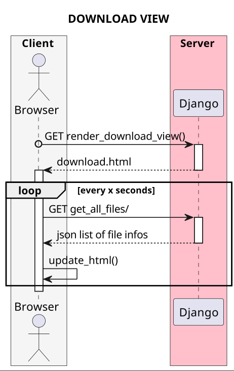
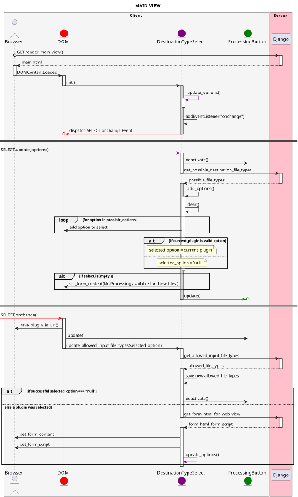
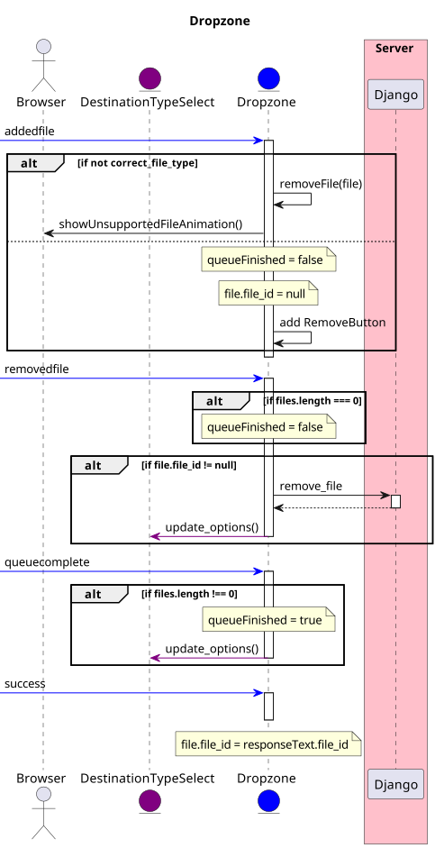
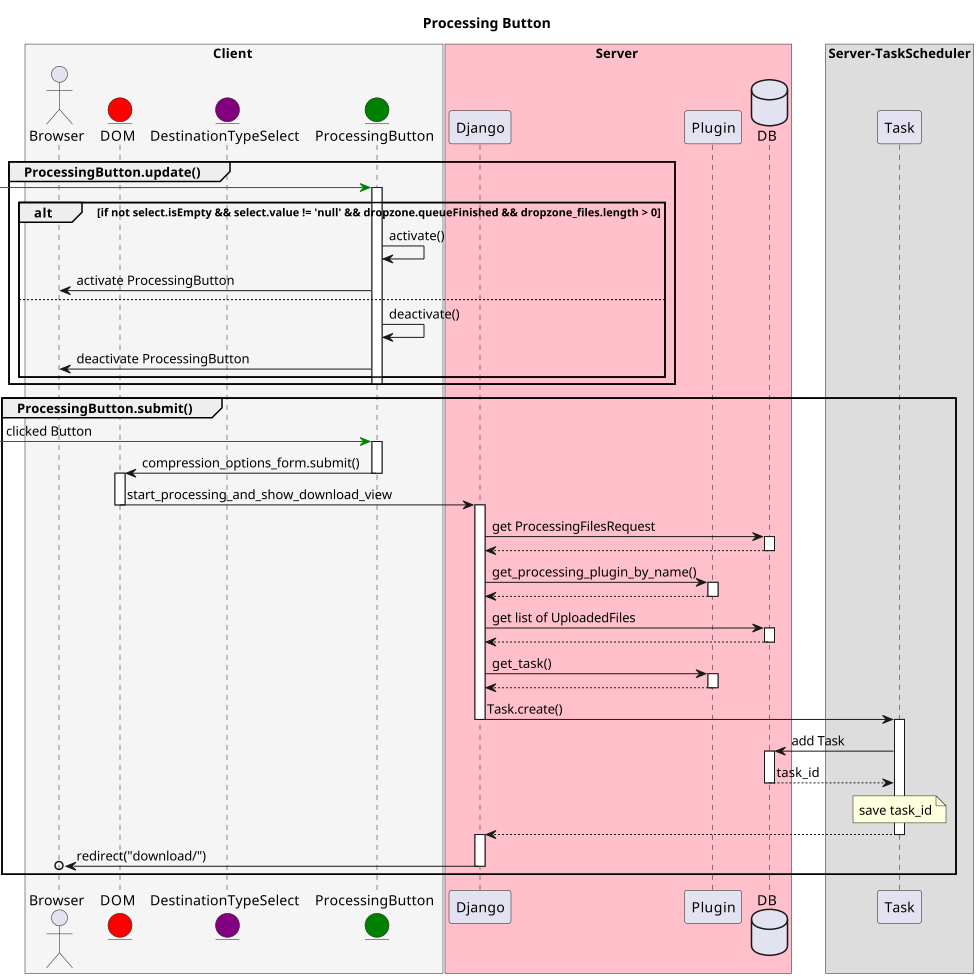
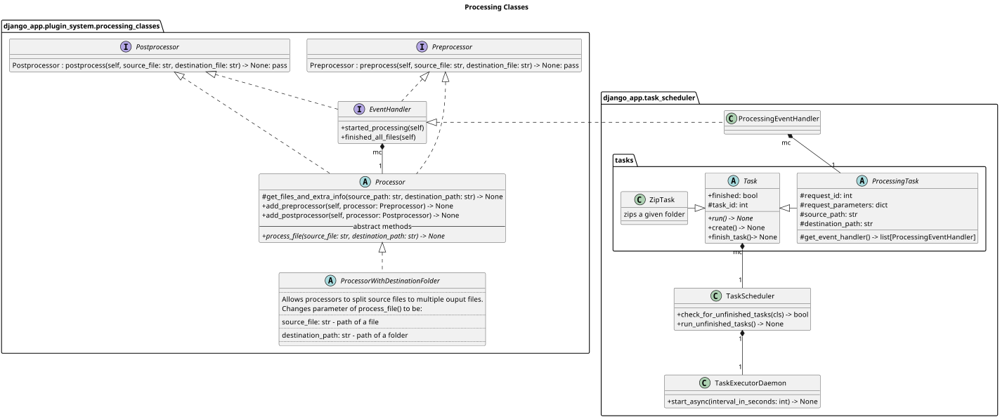
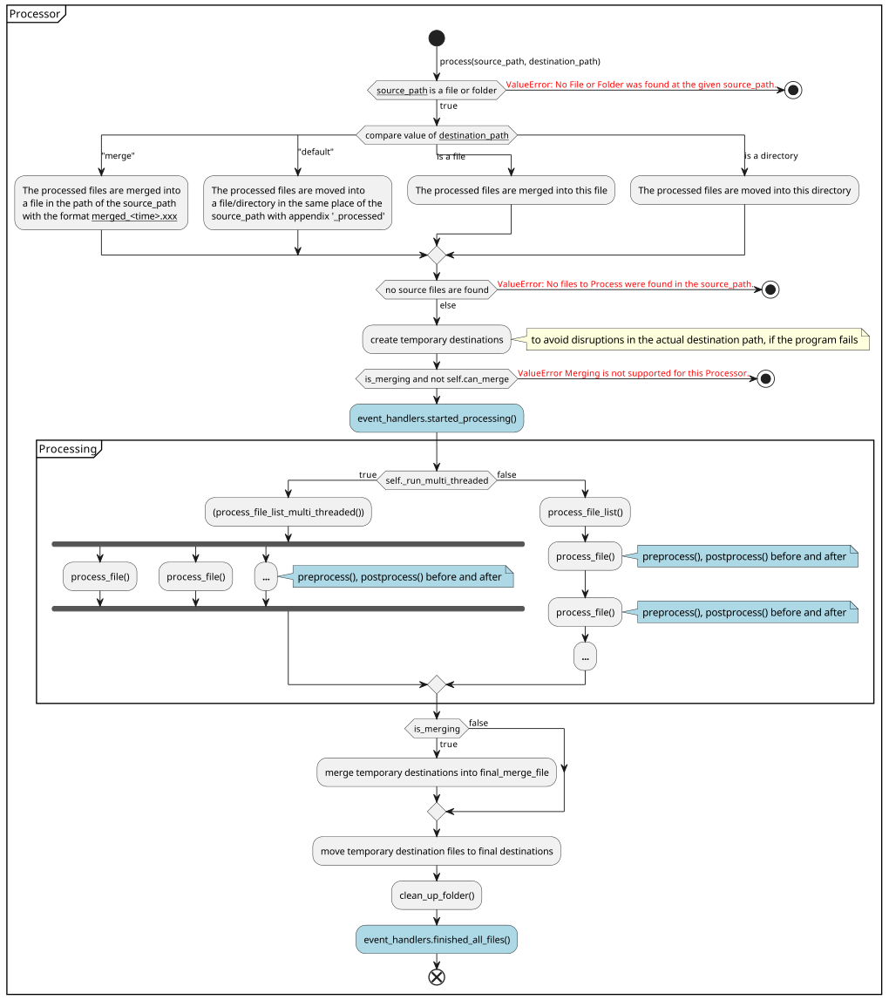
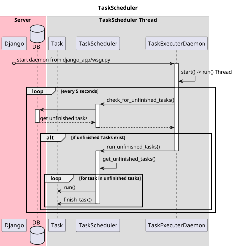

# Diagrams
The diagrams are made with [PlanUML](https://plantuml.com).

1. [Components](#Components)
2. [Requests](#Requests)
   1. [Api View](#Api View)
   2. [Download View](#Download View)
   3. [Main View](#Main View)
3. [Task Scheduler](#Task-Scheduler)
4. [Processor](#Processor)
   1. [Processor Class Diagram](#Processor-Class-Diagram)
   2. [Processor.process()](#Processor.process())

_____

## Components

[source/components.puml](source/components.puml)

_____

## Requests

### Api View
  
[source/views/django_api_view.puml](source/views/django_api_view.puml)  

### Download View
  
[source/views/django_download_view.puml](source/views/django_download_view.puml)  

### Main View
  
[source/views/django_main_view/main_view.puml](source/views/django_main_view/main_view.puml)  

  
[source/views/django_main_view/main_view_dropzone.puml](source/views/django_main_view/main_view_dropzone.puml)  

  
[source/views/django_main_view/main_view_processing_button.puml](source/views/django_main_view/main_view_processing_button.puml)  

_____

## Processor

### Processor Class Diagram
  
[source/processor/processor_classdiagram.puml](source/processor/processor_classdiagram.puml)  

### Processor.process()
  
[source/processor/processor.process.puml](source/processor/processor.process.puml)  
_____

## Task Scheduler

  
[source/task_scheduler.puml](source/task_scheduler.puml)  
